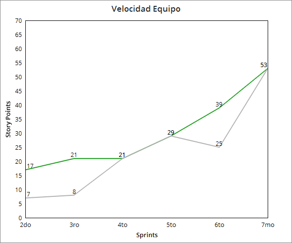

# UNQalendario

### Objetivo
La idea del proyecto es crear una plataforma web dirigido a los alumnos y profesores de la Universidad Nacional de Quilmes (UNQ). Cuyo objetivo principal es mejorar la comunicacion alumno-profesor, y la organizacion de las materias, de manera clara y eficiente. 

---

### Integrantes

Nro | Nombre       		| Legajo | Mail
----|-------------------|--------|------
1   |Uriel Piñeyro      |41176  |uriel.pineyro@alu.unq.edu.ar
2   |Uriel Quevedo 		|  36062 |quevedouriel3@gmail.com
3   |Lautaro Laghezza	|  35893  |lautariver35@gmail.com
4   |NicolasAlvarez		|  33073 |nicolas.alv3@gmail.com
5   | Jose Cassano 		|  34798 |cassanojoseluis@gmail.com

---
## Para correr el proyecto localmente:
- Tener instalado: 
    - Mongodb 
    - Gradle con version mayor a 4.7(Para uso de spring) 
    - nodejs 
    - npm
    
- Correr UNQalendarioApplication para levantar Spring

- Ir a "\UNQalendario\frontend"
- Escribir en la consola npm install y luego npm start **(Importar solo la carpeta backend en IntelliJ antes de ejecutar npm)**
- Abrir localhost:3000 en browser

---
## Para correr los test de Selenium

- Ir a la página de [ChromeDriver](http://chromedriver.chromium.org/downloads) y descargar la versión correspondiente a tu versión de Chrome y OS.
- Una vez descargado, colocar el archivo descargado y descomprimido en la carpeta `ui-testing` dentro del proyecto.
- Correr el proyecto como se explicó en la sección anterior, y luego, desde un IDE (recomendamos IntelliJ) hacer click derecho en eel archivo `testng.xml`, y desde ahí correrlo como test de TestNG.

---

## Informes de Sprints:

1. ### [Informe del primer sprint](Informes/InformePrimerSprint.md)

2. ### [Informe del segundo sprint](Informes/InformeSegundoSprint.md)

3. ### [Informe del tercer sprint](Informes/InformeTercerSprint.md)

4. ### [Informe del cuarto sprint](Informes/InformeCuartoSprint.md)

5. ### [Informe del quinto sprint](Informes/InformeQuintoSprint.md)
    - [**Demo**](https://www.youtube.com/watch?v=rrMvdRYtuXQ)
    - [**Informe spike de Test en UI: Selenium WebDriver**](Informes/Spikes/InformeSeleniumWebDriver.md)

6. ### [Informe del sexto sprint](Informes/InformeSextoSprint.md)
    - [**Demo**](https://youtu.be/6lyjHQYeYJU)

7. ### [Informe del septimo sprint](Informes/InformeSeptimoSprint.md)

---

## Grafico velocidad de equipo:

